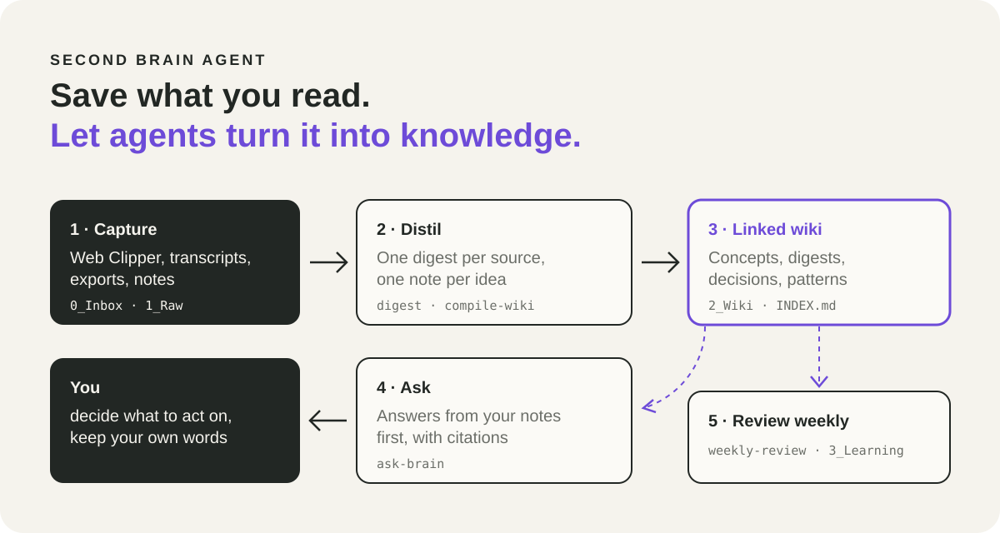
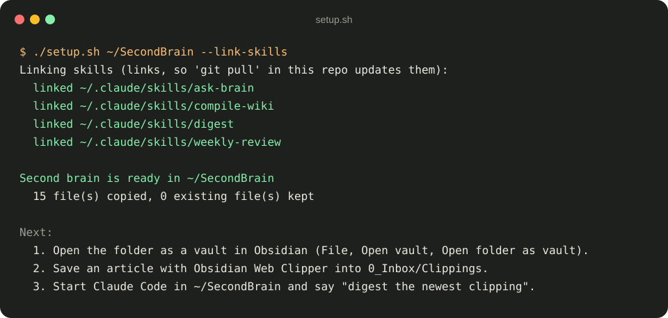
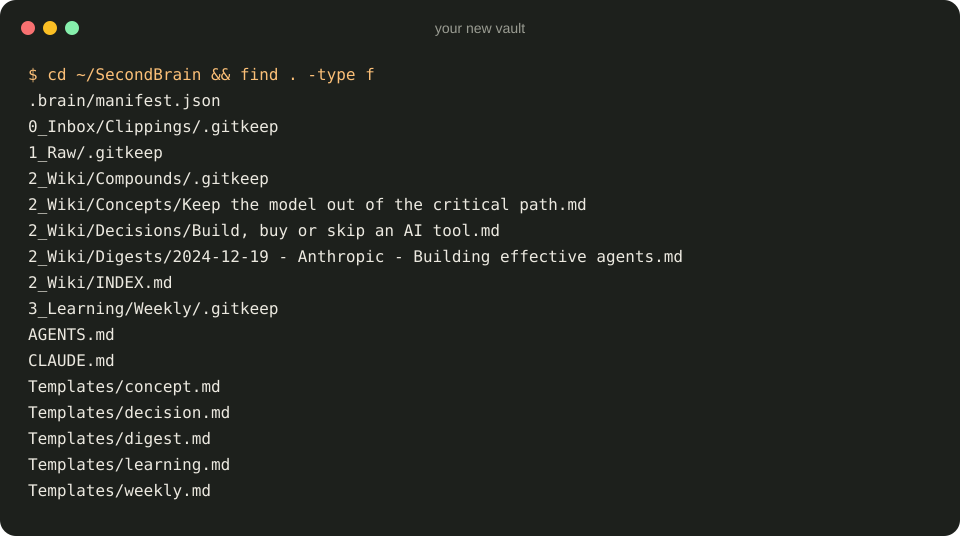
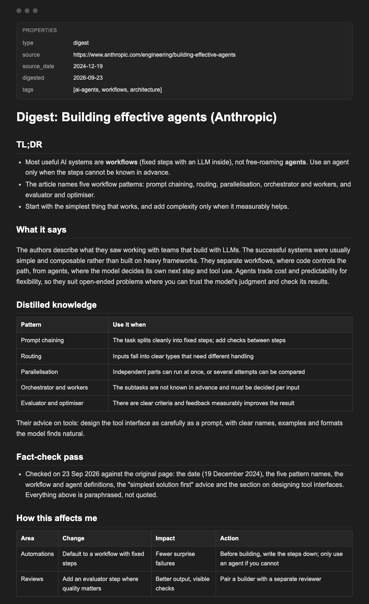
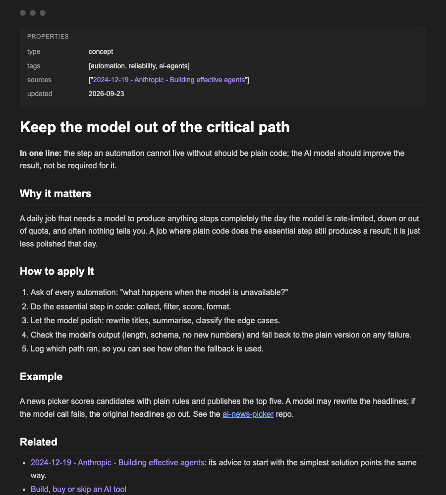
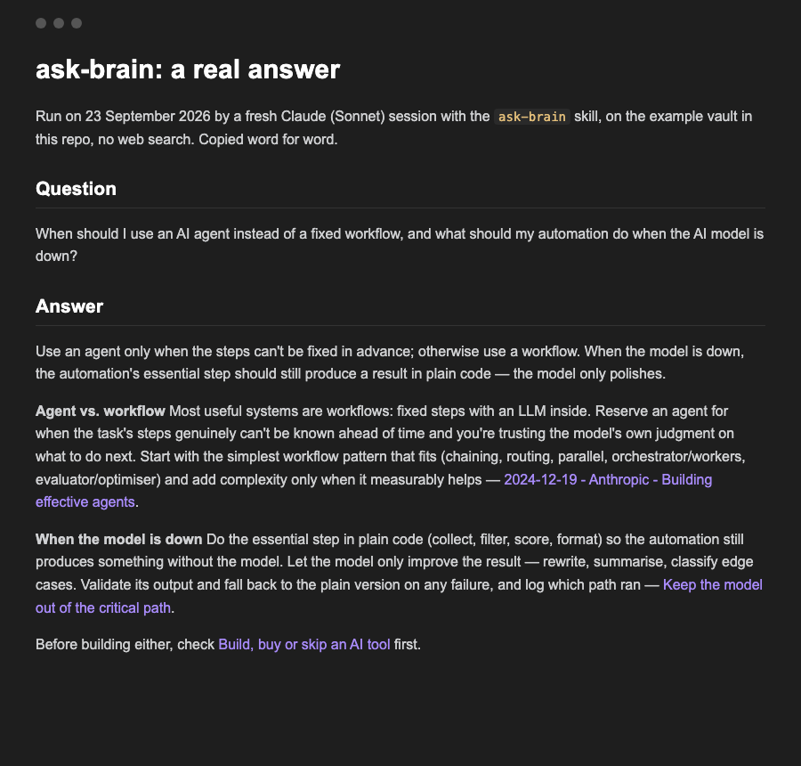

<div align="center">

# Second Brain Agent

**An Obsidian vault your AI agents can read, feed and keep tidy.**
Save what you read. Let agents turn it into knowledge you can ask.

[](LICENSE)
[](https://obsidian.md)
[](skills)
[](tests)
[](https://github.com/Rebelzxr/second-brain-agent/commits)

</div>

<p align="center">
  
</p>

Most notes apps become a graveyard: you save an article, never read it again, and forget you have it. This is a vault built for agents as much as for you. You capture. Agents write one digest per source, one note per idea, link everything, and answer your questions from your own notes first, with citations. Once a week they turn the week into one page.

## Quick start

```bash
git clone https://github.com/Rebelzxr/second-brain-agent.git
cd second-brain-agent
./setup.sh ~/SecondBrain --link-skills
```

1. In Obsidian: **Open folder as vault** and pick `~/SecondBrain`.
2. Save an article with [Obsidian Web Clipper](https://obsidian.md/clipper). In the clipper's settings, set the note location to `0_Inbox/Clippings` (its default is a `Clippings` folder).
3. Start Claude Code in `~/SecondBrain` and say **"digest the newest clipping"**.

Using Codex as well? Add `--codex` to link the skills into `~/.codex/skills` too.

## What it can do

- **Digest any long source** into one note: TL;DR, what it says, distilled knowledge, a fact-check of the top claims, what it means for you, what to steal or ignore, open questions.
- **Compile the inbox into a wiki:** new clippings and transcripts become one concept note per idea, linked to their sources. It never reprocesses old files or deletes anything.
- **Answer from your notes first:** questions are answered from the vault with `[[links]]` to the notes used, and the agent says plainly when the brain has nothing before searching the web.
- **Spot repeating ideas:** when the same idea shows up in three or more digests, the agent proposes a "compound" note.
- **Write a weekly review:** what happened, patterns, wins, where you got stuck, stop/start/continue and one bet for next week, each point linked to its source note.
- **Keep it trustworthy:** a rules file (`AGENTS.md`) inside the vault tells every agent to read before writing, cite sources, paraphrase and never touch your own words.

## See it work

**Setup** creates the vault and links the skills. Running it again never overwrites your notes unless you ask, and even then an existing skill folder is moved to `skills-backup/`, not deleted.

<p align="center"></p>

**The vault you get:** folders by stage, rules for agents (`AGENTS.md`, loaded by Claude Code through `CLAUDE.md`), an index, templates and three example notes.

<p align="center"></p>

**A digest note** in the format the `digest` skill writes, on Anthropic's "Building effective agents" article, with the fact-check recorded.

<p align="center"></p>

**A concept note** that several sources feed into, with its sources and related notes linked.

<p align="center"></p>

**Asking the brain.** A real answer from a fresh Claude session using the `ask-brain` skill on this example vault, with no web search. Every point links the note it came from. Word for word in [examples/ask-brain-answer.md](examples/ask-brain-answer.md).

<p align="center"></p>

`compile-wiki` and `weekly-review` need a few days of your own clippings and notes to show anything useful, so there is no sample of them here yet.

## Real use

My own vault uses this layout: a clippings inbox, a wiki of digests and concept notes, daily learning notes and a weekly review. `digest` and `compile-wiki` are simplified from the ones I run, `weekly-review` is adapted from my weekly review report, and `ask-brain` is new. My private notes are not in this repo. More of what I build is in the free [library on dainer.ai](https://dainer-ai.vercel.app/library).

## How it works

| Stage | Folder | Skill |
|---|---|---|
| Capture | `0_Inbox/Clippings/`, `1_Raw/` | You, or Obsidian Web Clipper |
| Distil | `2_Wiki/Digests/`, `2_Wiki/Concepts/` | `digest`, `compile-wiki` |
| Decide | `2_Wiki/Decisions/` | You, with the agent's help |
| Spot patterns | `2_Wiki/Compounds/` | Proposed by `digest`, written after your yes |
| Ask | the whole vault | `ask-brain` |
| Reflect | `3_Learning/`, `3_Learning/Weekly/` | You, and `weekly-review` |

`2_Wiki/INDEX.md` is the map every agent reads first. `.brain/manifest.json` remembers which inbox files were already compiled, so nothing is processed twice.

Pairs well with [ai-work-os](https://github.com/Rebelzxr/ai-work-os): put the vault next to your work folder and the weekly review also reads your work logs.

## Safety and data flow

- Everything is local: markdown files in your vault and four skill files.
- Skills read and write inside the vault. The exceptions: `digest` fetches a URL you give it and checks its top claims against the original sources; `ask-brain` searches the web only after you agree; `weekly-review` also reads a work folder's logs if you keep one next to the vault.
- The vault rules tell agents never to copy client details, money figures or personal messages into shared notes, and never to send vault content to another tool unless you ask.

## Limitations

- The skills are instructions for an agent, not a program. Results depend on the agent and model you use.
- Fact-checks are only as good as the sources the agent can reach. The note records what it could not check.
- The example notes are in English; the skills work in any language your agent handles.

## Repo structure

```text
second-brain-agent/
├── setup.sh                  create the vault, link the skills
├── vault/                    the Obsidian vault template
│   ├── AGENTS.md             rules for agents in the vault
│   ├── CLAUDE.md             loads AGENTS.md in Claude Code
│   ├── 0_Inbox/Clippings/    Web Clipper lands here
│   ├── 1_Raw/                transcripts, exports, long dumps
│   ├── 2_Wiki/               INDEX.md, Concepts, Digests, Decisions, Compounds
│   ├── 3_Learning/           daily notes and Weekly reviews
│   └── Templates/            concept, digest, decision, learning, weekly
├── skills/                   digest, compile-wiki, ask-brain, weekly-review
├── examples/                 a real ask-brain answer
├── tests/                    setup, skill frontmatter and wiki-link checks
└── assets/                   the images in this README
```

## Credits and licence

MIT, see [LICENSE](LICENSE). The example digest summarises [Building effective agents](https://www.anthropic.com/engineering/building-effective-agents) by Erik S. and Barry Zhang (Anthropic, 19 December 2024) in my own words; read the original. Obsidian and Obsidian Web Clipper are made by Obsidian.

## About

Built by Dainer in Kuala Lumpur. I build with AI and share what's worth teaching from real work and business.
Free library: [dainer-ai.vercel.app/library](https://dainer-ai.vercel.app/library) · Site: [dainer-ai.vercel.app](https://dainer-ai.vercel.app)

Related: [ai-work-os](https://github.com/Rebelzxr/ai-work-os) · [ai-news-picker](https://github.com/Rebelzxr/ai-news-picker) · [fable-forge](https://github.com/Rebelzxr/fable-forge)
